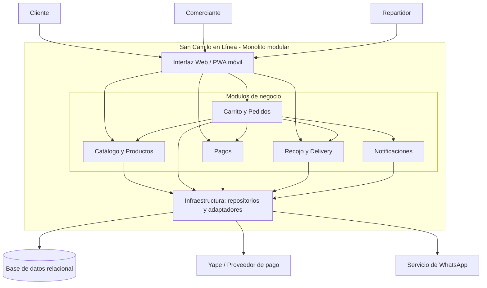

# San Camilo en Línea — Laboratorio 04: Fundamentos de arquitectura de software

Construcción de Software · EPIS-UNSA · 2026-B · Grupo 07

## Integrantes

| Nombre | Rol en el laboratorio |
|--------|-----------------------|
| Flores Nuñez Rodrigo Francisco | Diagramador |
| Jimenez Paredes Fabricio Gabriel | Redactor de drivers |
| Bravo Arredondo Cristhian Matías | Verificador de IA |

## Caso

**San Camilo en Línea** es una plataforma para hacer pedidos a los puestos del Mercado San Camilo, con recojo en el mercado o delivery. Los actores son el cliente, el comerciante y el repartidor.
El MVP incluye un catálogo por puesto, pedidos con productos de varios puestos, pago con Yape y confirmación del pedido al comerciante por WhatsApp.
**Atributo de calidad crítico:** la capacidad de interacción. Un comerciante con poca experiencia digital debe poder publicar un producto en **3 toques o menos desde un celular de gama baja** (QA-01).
Para cumplirlo, elegimos un **monolito modular** ([ADR-001](docs/architecture/001-estilo-arquitectonico.md)) con una **PWA** mobile-first ([ADR-002](docs/architecture/002-pwa-vs-app-nativa.md)).

## Arquitectura elegida

## Decisiones arquitectónicas

- [ADR-001: Adoptar un monolito modular para el MVP](docs/architecture/001-estilo-arquitectonico.md)
- [ADR-002: Usar una PWA en lugar de una app nativa](docs/architecture/002-pwa-vs-app-nativa.md)
- [ADR-003: Enviar las confirmaciones de WhatsApp de forma asíncrona con reintentos](docs/architecture/003-notificaciones-asincronas.md)

## Documentación y diagramas

- [Drivers arquitectónicos y escenarios de calidad (E1)](docs/architecture/drivers.md)
- [Matriz de decisión (E2)](docs/architecture/matriz-decision.md)
- [Diagrama Mermaid de la arquitectura elegida (E3)](diagrams/arquitectura.mmd)
- [Alternativa descartada en PlantUML (E5)](diagrams/alternativa.puml)
- [Vista de despliegue con Python Diagrams (E6)](diagrams/despliegue.py)
- [Bitácora de uso de IA (E7)](docs/architecture/bitacora-ia.md)

## Reflexión sobre el uso de la IA

La IA nos ayudó a avanzar más rápido. Con ChatGPT generamos y comparamos alternativas, y le pedimos una crítica adversarial. Gemini nos dio borradores de los ADR, Claude escribió el código de PlantUML y de Python Diagrams, y Claude Code nos ayudó a ordenar la bitácora y este README.
También cometió errores. Asumió infraestructura en AWS aunque nuestra restricción era un VPS. Usó una sintaxis desactualizada de la librería `diagrams`, que daba `AttributeError`. Omitió la nota de descarte del PlantUML aunque se la pedimos.
Además, no aceptamos dar por hecho que Yape tiene una API pública abierta sin verificarlo, así que en la arquitectura dejamos "Yape / proveedor de pago".
Aprendimos a contrastar cada propuesta con nuestras restricciones (plazo de 1 mes, presupuesto bajo, equipo de 3), a ejecutar y validar todo el código generado y a no afirmar capacidades de servicios externos sin documentación oficial.
La IA propone, pero el equipo decide y verifica.
